  <picture>
    <source media="(prefers-color-scheme: dark)" srcset="assets/dark.svg">
    <source media="(prefers-color-scheme: light)" srcset="assets/light.svg">
    
  </picture>

  <b>Digital Analytics → Solutions Engineering | Analytics Engineering | AI Workflow Engineering</b>

I enjoy turning complex business problems into scalable technical solutions through systems thinking, analytics, automation, and thoughtful engineering.

## 🛠️ What I'm Working On

- 📊 **Working with:** GA4, GTM, Server-Side GTM, BigQuery
- ⚙️ **Interested in:** Analytics Engineering, Solution Design, Workflow Automation
- 🚀 **Building:** Productivity apps, analytics projects, developer tools, and AI-powered workflows
- 🌱 **Learning:** SQL, JavaScript, dbt, Cloud Fundamentals, and System Design

---

## 💡 Philosophy

I love bridging business needs with technical implementation—creating tools that are intentional, practical, and enjoyable to use.

I believe the best software quietly solves problems and helps people work more effectively. ✨

---

### 💌 Let's Connect

